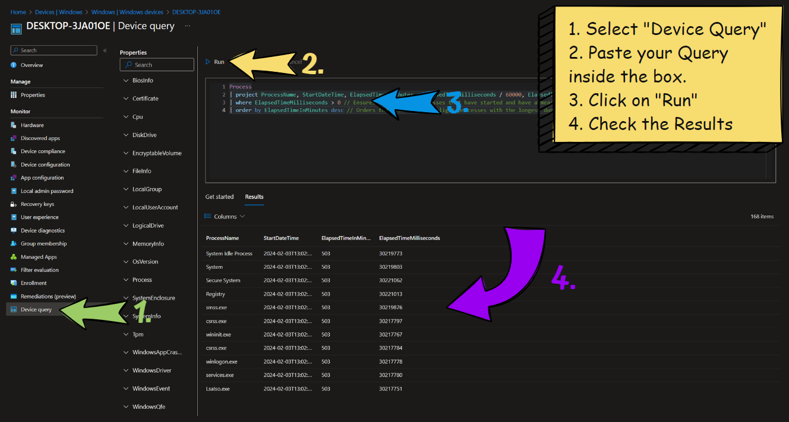

# Intune Device Query - KQL Queries

  
  

# Overview

In this repo you will find a lot of KQL Queries that you can copy and paste and run them in Intune.

You can find more KQL Queries here at [KQLSearch.com](https://www.KQLSearch.com)

# What is Device Query in Intune?

Device query allows you to quickly gain on-demand information about the state of your devices. When you enter a query on a selected device, Device query runs a query in real time. The data returned can then be used to respond to security threats, troubleshoot the device, or make business decisions.

Details:

Device Query -> [Device query](https://learn.microsoft.com/en-us/mem/analytics/device-query)

Data Platform Schema -> [Data Platform Schema](https://learn.microsoft.com/en-us/mem/analytics/data-platform-schema)

# Requirements

- License:
  - The Intune Advanced Analytics Add-on OR
  - Microsoft Intune Suite
- The Windows Device has to be running and connected to the Internet.
- To use Device query on a device, the device must be enrolled in Endpoint Analytics.
- To use Device query, devices must be Intune managed and corporate owned.
- For a user to use Device query, you must assign the Managed Devices - Query permission to them.

# How to use the queries in Intune

# Contributing

Feel free to fork the repository and submit pull requests. For major changes, please open an issue first to discuss what you would like to change.
